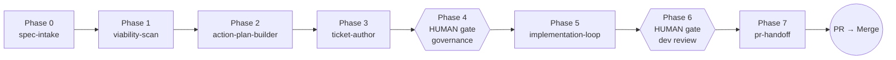

# ASDD — Agentic Spec-Driven Development

> **Spec-Gated, Loop-Verified Delivery**
>
> Pipeline: **Spec → Scan → Plan → Ticket → Build → PR**
>
> Canonical, platform-neutral methodology for AI-assisted work. One flow, two
> profiles: **Backend** and **Frontend**. Same principles, same phases, same
> gates — profile-specific rubrics only where they must differ (contracts,
> touchpoints, conventions).

---

## Table of contents

- [Why ASDD?](#why-asdd)
- [What this repo is](#what-this-repo-is)
- [Prerequisites](#prerequisites)
- [Getting started](#getting-started)
  - [The final layout](#the-final-layout)
  - [Which files are strictly required?](#which-files-are-strictly-required)
  - [Steps](#steps)
- [Coexisting with existing setups](#coexisting-with-existing-setups)
- [Kick off a feature](#kick-off-a-feature)
  - [How the agent produces artifacts](#how-the-agent-produces-artifacts)
- [Directory layout](#directory-layout)
- [Core principles](#core-principles-never-negotiable)
- [Roadmap](#roadmap)

---

## Why ASDD?

AI-assisted development on production code repeatedly hits the same four
failure modes:

- **Spec drift.** The agent implements what it *thinks* you meant, not what
  Business/Product actually approved. Acceptance Criteria are inferred, not
  contracted.
- **Rushed convergence.** The first draft ships as "done"; the self-review
  pass is skipped or performed by the same agent that authored the draft.
  Hidden debt lands invisible.
- **Skipped gates.** Code goes straight from prompt to PR without ticket
  governance, without manual testing, without a governance checkpoint.
- **Silent side effects.** The agent runs `npm install`, `dotnet ef migrations`
  or `git push` on your behalf, mutating state without your explicit action.

ASDD closes all four with five non-negotiable disciplines: **spec first**,
**humans own the gates**, **loop until convergence**, **root cause not
shortcuts**, and **console commands are humans-only**. Same rules on
Frontend and Backend; same rules on any stack; same rules with any AI
coding agent.

---

## What this repo is

`ai-workflow` is the **portable core of ASDD**. It is designed to be dropped into
any project inside an `asdd/` buffer folder and consumed by any coding agent
(GitHub Copilot, Claude Code, Codex, Cursor). It carries:

- The **master flow** (`ASDD.md`) — 8 phases, human gates, self-verification loop.
- **Skills** for every phase (neutral base + `.fe.md` / `.be.md` overlays).
- **Templates** — ticket (per profile), reusable loop prompt, neutral `AGENTS.md`.
- **Examples** — real tickets and profile-specific `AGENTS.md` samples.

The repo is **agent-agnostic** and **framework-agnostic**. Nothing is
hard-coded to a specific stack; profile overlays adapt each skill to
Frontend or Backend concerns.

---

## Prerequisites

Before adopting ASDD, your project needs:

- **`git`** installed locally. Used for the buffer folder and for the
  Delivery phase.
- **An AI coding agent** with access to your repo — one of GitHub Copilot,
  Claude Code, Codex, Cursor, or any agent that reads `AGENTS.md`.
- **Read/write permission on the project root**, so you can place the
  connection layer (`AGENTS.md`, `.gitignore`, optional shims).

Nothing else. ASDD is framework-agnostic — no runtime, no build system,
no database, no CI setup is required to *install* it. The methodology
adapts to whatever your project already uses.

---

## Getting started

Any developer, on any project (single-repo or monorepo, Frontend or Backend),
can adopt ASDD in **five steps** by placing a small **connection layer**
at the root of their project. The layer never duplicates rules — it only
points at the methodology cloned inside `asdd/ai-workflow/`.

### The final layout

This is what your project looks like once ASDD is active. Every arrow with
"connects" is a **shim**: a minimal pointer file (≤30 lines) that a specific
agent tool reads by convention.

```text
<your-project>/                              ← your project (git init A)
├── .git/                                    ← your project's git
├── .gitignore                               ← includes "asdd/"
├── AGENTS.md                                ← [required] anchor: conventions + `asdd_profile:` frontmatter
│                                                 connects → any agent
├── CLAUDE.md                                ← [optional] Claude Code shim
│                                                 connects → Claude Code CLI
├── .github/
│   └── copilot-instructions.md              ← [optional] Copilot shim
│                                                 connects → GitHub Copilot
├── .cursor/
│   └── rules/
│       └── asdd.md                          ← [optional] Cursor shim
│                                                 connects → Cursor / Codex
├── src/                                     ← your code
└── asdd/                                    ← manual buffer, NOT tracked by git A
    ├── config.yml                           ← [optional] consumer overrides
    └── ai-workflow/                         ← clone of this repo (git init B)
        ├── .git/                            ← ai-workflow's own git
        ├── AGENTS.md                        ← methodology's base spec
        ├── ASDD.md                          ← master workflow
        ├── skills/
        ├── templates/
        └── ...
```

- **`asdd/`** is a plain folder created by hand. It has no `.git/` of its own.
  Its only purpose is to isolate the ai-workflow clone from your project's
  `git init` so both repos keep independent histories.
- **`asdd/ai-workflow/`** is the clone of this repository — untouched. You
  can `git pull` from inside it to fetch methodology updates without
  affecting your project.
- **`asdd/config.yml`** (optional) lives *outside* the clone so it is not
  touched by `git pull` — it is consumer state, not methodology state.
- **The connection layer at the project root** (`AGENTS.md` + optional
  shims) is what every agent tool actually reads first. Without it, no
  agent would know that `asdd/ai-workflow/` exists — each tool looks for
  instructions in fixed, convention-based locations.

### Which files are strictly required?

- **`AGENTS.md`** at the project root: **always required**. It is the anchor
  that declares the ASDD profile (via frontmatter) and holds the project's
  code conventions.
- **`.gitignore` entry for `asdd/`**: **always required**, otherwise the
  buffer pollutes your project's git.
- **Agent-specific shims** (`CLAUDE.md`, `.github/copilot-instructions.md`,
  `.cursor/rules/asdd.md`): only required for the agents your team actually
  uses. Copy the ones you need, skip the rest.

### Steps

Run all commands from the root of your project.

> **Fast path.** If you already have an ASDD-aware agent in your
> session (Copilot with the shim installed, Claude Code with the
> shim, Cursor with the shim, or any agent that reads `AGENTS.md`),
> you can **skip the manual steps below** and simply ask:
>
> `Start ASDD` · `Iniciar ASDD` · `Run ASDD` · `asdd init`
>
> The agent will run a read-only detection of the connection layer at
> your project root and list the exact commands you need to run to fill
> any gaps. It never runs those commands itself — you do. The detection
> logic lives in
> [`prompts/bootstrap.md`](prompts/bootstrap.md).
>
> This works only **after** step 1 (the repo must be cloned so the
> agent can read the bootstrap prompt).

#### 1. Create the buffer folder and clone `ai-workflow`

```bash
mkdir asdd
cd asdd
git clone https://github.com/<org>/ai-workflow.git
cd ..
```

Result: `asdd/ai-workflow/` contains the methodology with its own `.git/`.

#### 2. Ignore the buffer in your project's git

```bash
echo "asdd/" >> .gitignore
git add .gitignore
git commit -m "chore: ignore local ASDD workspace"
```

#### 3. Copy the AGENTS.md template and declare the profile

Copy the template that matches your stack, then edit it to reflect your
project's conventions.

The snippets below use a **safe-copy** pattern: if the target file already
exists, the template lands next to it with a `.new` suffix so you can
diff and merge instead of losing your existing content. See
[Coexisting with existing setups](#coexisting-with-existing-setups) for
the merge workflow.

```bash
# Frontend project:
[ -e ./AGENTS.md ] \
  && cp asdd/ai-workflow/templates/AGENTS.md.fe.example ./AGENTS.md.new \
  || cp asdd/ai-workflow/templates/AGENTS.md.fe.example ./AGENTS.md

# Backend project:
[ -e ./AGENTS.md ] \
  && cp asdd/ai-workflow/templates/AGENTS.md.be.example ./AGENTS.md.new \
  || cp asdd/ai-workflow/templates/AGENTS.md.be.example ./AGENTS.md
```

The profile is declared in the ASDD frontmatter at the top of `AGENTS.md`
(`asdd_profile: fe` or `asdd_profile: be`). ASDD resolves the profile in
this order of precedence:

1. **Frontmatter in `AGENTS.md`** (recommended for single-stack repos).
2. **`asdd/config.yml`** (recommended for monorepos with per-package
   overrides — see `asdd/ai-workflow/config.example.yml`).
3. **Autodetection** by `repo-viability-scan` (fallback). Detects FE from
   `package.json` + `vue|react|angular|svelte`; detects BE from `.csproj`,
   `pom.xml`, `go.mod`, `Cargo.toml`, `pyproject.toml`, `build.gradle`.

#### 4. Wire the shim(s) for the agent(s) you use

Each shim is a small pointer file (≤30 lines) that tells its agent tool:
"read `AGENTS.md` first; the ASDD workflow lives in `asdd/ai-workflow/`".
Copy only the ones you need. All snippets use the **safe-copy** pattern
(target already exists → land as `.new`; see
[Coexisting with existing setups](#coexisting-with-existing-setups)).

- **GitHub Copilot** → `.github/copilot-instructions.md`:

  ```bash
  mkdir -p .github
  [ -e .github/copilot-instructions.md ] \
    && cp asdd/ai-workflow/templates/copilot-instructions.md.example .github/copilot-instructions.md.new \
    || cp asdd/ai-workflow/templates/copilot-instructions.md.example .github/copilot-instructions.md
  ```

  Full template: [`templates/copilot-instructions.md.example`](templates/copilot-instructions.md.example).

- **Claude Code** → `CLAUDE.md` at the project root:

  ```bash
  [ -e ./CLAUDE.md ] \
    && cp asdd/ai-workflow/templates/CLAUDE.md.example ./CLAUDE.md.new \
    || cp asdd/ai-workflow/templates/CLAUDE.md.example ./CLAUDE.md
  ```

  Full template: [`templates/CLAUDE.md.example`](templates/CLAUDE.md.example).

  Optionally, add per-skill wrappers at `.agents/skills/<name>/SKILL.md`
  with the frontmatter `name:` / `description:` and a `See:` line pointing
  to `asdd/ai-workflow/skills/<name>.md` (+ overlay).

- **Codex / Cursor** → `.cursor/rules/asdd.md`:

  ```bash
  mkdir -p .cursor/rules
  [ -e .cursor/rules/asdd.md ] \
    && cp asdd/ai-workflow/templates/cursor-rules.md.example .cursor/rules/asdd.md.new \
    || cp asdd/ai-workflow/templates/cursor-rules.md.example .cursor/rules/asdd.md
  ```

  Full template: [`templates/cursor-rules.md.example`](templates/cursor-rules.md.example).

The **source of truth** for every skill is the file under
`asdd/ai-workflow/skills/`. Shims only point at it. Do not duplicate content.

#### 5. (Optional) Update ai-workflow later

From your project root:

```bash
git -C asdd/ai-workflow pull
```

Your project's git is untouched. The shims and `AGENTS.md` at the project
root do not need to change either — they only carry pointers, so future
updates to skills / templates / prompts flow automatically.

If your team prefers to version the ASDD reference alongside the project,
the alternative is a git submodule. Most teams find the plain clone
simpler because each developer's `asdd/` can be checked out at a
different ASDD version without touching the project's git tree.

---

## Coexisting with existing setups

Most projects that adopt ASDD already have **some** agent tooling in
place: an `AGENTS.md`, a `.cursorrules`, a `.github/copilot-instructions.md`,
Claude Code SKILL files, or configured MCP servers. ASDD does **not**
require you to throw any of that away. The design principle is:

> **`AGENTS.md` at the project root is the single canonical source of
> conventions. Everything else (shims, per-tool wrappers, MCP configs)
> either points at it or extends it, but never duplicates rules.**

If the safe-copy steps produced `.new` files, this section explains how
to reconcile them. If `repo-viability-scan` (Phase 1) reports "existing
agent tooling detected", start here as well.

### General reconciliation pattern — merge, don't replace

For every `<file>.new` produced by the safe-copy step:

1. **Diff.** `diff <file> <file>.new` (or open both in your editor).
2. **Keep everything project-specific** from your existing file: repo
   paths, domain terms, commands verified against your stack, prohibitions
   your CI already enforces.
3. **Add anything ASDD-required** that is missing in yours: the ASDD
   frontmatter block, the 9 canonical `## …` headings (in order), the
   pointer to `asdd/ai-workflow/` where applicable, the shared rules
   linked from [`AGENTS.md`](AGENTS.md) (workflow discipline,
   ticket format, SSOT, delivery, minimal-comments, token-efficiency).
4. **Never duplicate** a rule that lives in `asdd/ai-workflow/`.
   Link to it.
5. Delete the `.new` file once the merge is complete.

### (a) Pre-existing `AGENTS.md` at the project root

If your project already has an `AGENTS.md`, the safe-copy landed
`AGENTS.md.new`. Merge it into your existing file by:

- Prepending the **ASDD frontmatter** block from `.new` if you do not
  already have it (`asdd_profile:`, `base_branch:`, `ticketing:`).
- Adding any of the **9 canonical section headings** you are missing,
  in the exact order defined by
  [`AGENTS.md` → Canonical structure](AGENTS.md#canonical-structure--9-sections-in-this-order):
  *Project Overview / Project Layout / Domain Core / Tooling / Basic
  Project Commands / Testing / Code Conventions / Commit & PR Conventions /
  What NOT to Do*.
- Adding a **`## Shared rules that every AGENTS.md must enforce`** block
  (or a link) so Rules #1–#7 from the base are honored — do not restate
  them; link to `asdd/ai-workflow/AGENTS.md`.
- Keeping your existing content untouched inside each canonical section.

### (b) Pre-existing `.github/copilot-instructions.md`

If your team already has GitHub Copilot instructions, the safe-copy
landed `copilot-instructions.md.new`. Merge:

- **Keep** your existing Copilot rules verbatim.
- **Append** the ASDD block from `.new` (the two "read AGENTS.md first"
  bullets + the `Guardrails` section). It is short (~20 lines) and does
  not conflict with typical Copilot instructions.
- If your existing file already tells Copilot to read `AGENTS.md`, only
  append the `Guardrails` bullets and the reference to
  `asdd/ai-workflow/`.

### (c) Pre-existing `.cursorrules` or `.cursor/rules/*.md`

If you already have Cursor rules:

- **Keep** your existing rule files.
- Add `.cursor/rules/asdd.md` from the safe-copy (or from
  `.cursor/rules/asdd.md.new`). Cursor loads **all** files under
  `.cursor/rules/`; adding one more does not remove or override
  existing rules.
- If your existing rules cover code style / commit format at project
  scope, **do not** re-add them in `asdd.md`. The ASDD shim only carries
  workflow discipline.

### (d) Pre-existing `CLAUDE.md` or `.agents/skills/*/SKILL.md`

If you already have Claude Code instructions or per-skill SKILL files:

- **Keep** your existing SKILL files. ASDD does **not** ship its own
  Claude SKILL files; the seven ASDD skills live under
  `asdd/ai-workflow/skills/` and are consumed by any agent that follows
  the wrapper convention described in
  [Getting started → Step 4](#4-wire-the-shims-for-the-agents-you-use).
- If your existing `CLAUDE.md` already says "read `AGENTS.md`", you can
  skip the ASDD shim entirely. Otherwise merge `CLAUDE.md.new` by
  prepending the two "read `AGENTS.md`" lines to your existing content.
- If you have a Claude SKILL with the same name as one of the seven
  ASDD skills (unlikely — the names are `spec-intake`,
  `repo-viability-scan`, `action-plan-builder`, `ticket-author`,
  `ticket-quality-gate`, `implementation-loop`, `pr-handoff`), pick one
  as canonical and delete or rename the other; do not run both.

### (e) Pre-existing MCP servers

ASDD does **not** configure MCP servers of its own. It benefits from
whatever MCP is already available in your session:

- **Context7 MCP** — mentioned in both `AGENTS.md.<profile>.example`
  templates under `## Tooling`. If installed, agents use it for
  framework / library docs automatically.
- **Ticketing MCP** (Azure DevOps, GitHub Issues, Jira, Linear) — future
  ASDD roadmap; today `ticket-author` emits Markdown and you (or your
  own MCP) push it to your tracker.
- **Design MCP** (Figma) — future ASDD roadmap for `spec-intake.fe`.
- **OpenAPI MCP** — future ASDD roadmap for `spec-intake.be`.
- **Any other MCP** you already have (GitKraken, Playwright, GitHub,
  Chronicle, etc.) — declare it in your `AGENTS.md` under `## Tooling`
  with a one-line description of when the agent should use it. ASDD
  skills reference `## Tooling` when they need an MCP hint.

If a skill under `asdd/ai-workflow/skills/` names a specific MCP that
you do not have, the skill degrades gracefully to file-based
introspection (grep, glob, read); no MCP is strictly required.

### When in doubt

Re-run **Phase 1 — `repo-viability-scan`**. Its FE and BE overlays
detect existing agent tooling and report it as a landmine in the
Viability Report so the human decides which files to keep, merge, or
delete before any code is written.

---

## Kick off a feature

Once installed and activated, tell any agent:

> "Start ASDD for `<feature name>` from `<Mode A: raw context | Mode B: ticket #123>`."

The eight phases flow through two human gates and end at an open PR:



- **AI phases** (0, 1, 2, 3, 5, 7). The agent drafts each artifact and runs
  the self-verification loop until convergence. It never executes build /
  test / migration / `git push` commands — it lists them for the Developer.
- **Human gates** (Phase 4 and Phase 6). The Developer reviews and approves
  before the flow moves on. Rejection loops back to the previous phase.
- **Escalation.** At any point, if the loop hits its budget or a decision
  is blocked, the agent emits an *Unresolved & Escalations* section and
  stops — it never reports incomplete work as done.

See [`ASDD.md`](ASDD.md) for the full per-phase definitions, gates,
and rubrics.

### How the agent produces artifacts

Every response, ticket, plan and code diff the agent emits honors the
shared behavior rules defined in [`AGENTS.md`](AGENTS.md):

- **Minimal comments in generated code** (Rule #6). No inline comments
  unless genuinely necessary, carrying important non-obvious context, or
  explicitly requested. The only agent-initiated comment allowed is a
  file-header block of **at most 3 lines**.
- **Token efficiency** (Rule #7). No preambles, no restating the request,
  no closing summaries after edits; bullets and tables over prose when the
  content is structured; batched tool operations; references by path/link
  instead of quoting content.

These are enforced by the self-verification loop
([`prompts/loop-self-verify.md`](prompts/loop-self-verify.md), rubric
row **#9 — Comment discipline**) and by every profile template's
`What NOT to Do` section.

---

## Directory layout

```text
asdd/                                   ← manual buffer, ignored by your project's git
├── config.yml                          ← optional; consumer-owned overrides
└── ai-workflow/                        ← clone of this repo
    ├── README.md                          ← this file
    ├── ASDD.md                            ← master flow (profile-agnostic)
    ├── AGENTS.md                          ← canonical AGENTS.md spec (shared base)
    ├── CLAUDE.md                          ← shim: read AGENTS.md first
    ├── config.example.yml                 ← template for asdd/config.yml
    ├── templates/
    │   ├── AGENTS.md.fe.example           ← Frontend AGENTS.md template
    │   ├── AGENTS.md.be.example           ← Backend AGENTS.md template
    │   ├── CLAUDE.md.example              ← Claude Code root shim
    │   ├── copilot-instructions.md.example ← GitHub Copilot shim (→ .github/)
    │   ├── cursor-rules.md.example        ← Cursor rules shim (→ .cursor/rules/)
    │   ├── ticket.fe.md                   ← FE ticket (Links to Figma as heading 3)
    │   └── ticket.be.md                   ← BE ticket (Contracts & Specs as heading 3)
    ├── prompts/
    │   └── loop-self-verify.md            ← reusable self-verification engine
    └── skills/
        ├── spec-intake.md                 ← Phase 0 (base)
        ├── spec-intake.fe.md              ←   overlay: FE
        ├── spec-intake.be.md              ←   overlay: BE
        ├── repo-viability-scan.md         ← Phase 1 (base)
        ├── repo-viability-scan.fe.md
        ├── repo-viability-scan.be.md
        ├── action-plan-builder.md         ← Phase 2 (base)
        ├── action-plan-builder.fe.md
        ├── action-plan-builder.be.md
        ├── ticket-author.md               ← Phase 3 (base)
        ├── ticket-author.fe.md
        ├── ticket-author.be.md
        ├── ticket-quality-gate.md         ← Phase 4 (base)
        ├── ticket-quality-gate.fe.md
        ├── ticket-quality-gate.be.md
        ├── implementation-loop.md         ← Phase 5 (base)
        ├── implementation-loop.fe.md
        ├── implementation-loop.be.md
        ├── pr-handoff.md                  ← Phase 7 (base)
        ├── pr-handoff.fe.md
        └── pr-handoff.be.md
```

---

## Core principles (never negotiable)

1. **Spec first, always.** No AC + use cases + contracts ⇒ flow does not start.
2. **Humans own the gates** (tickets, review/testing, PR).
3. **Loop until convergence.** No first-try deliveries.
4. **Root cause, not shortcuts.** Silencing / narrowing / hiding is forbidden.
5. **Granular and parallelizable.** One slice → one ticket → one focused PR.
6. **Immutable ticket format.** 4 headings, in order, per profile template.
7. **Two entry points.** Raw business context (Mode A) or groomed ticket (Mode B).
8. **Console commands: humans only.** AI proposes; Developer runs.
9. **Single Source of Truth (SSOT).** Every rule, template, and contract
   has exactly one canonical location; everything else links to it.

See [`ASDD.md`](ASDD.md) for the full flow and per-phase definitions.
See [`AGENTS.md`](AGENTS.md) for the shared rules the agent honors on
every repo (including **Rule #6 — minimal comments** and **Rule #7 —
token efficiency**, which govern how code and responses are produced).

---

## Roadmap

| Item                                                    | Status               | Details                                                                             |
|---------------------------------------------------------|----------------------|-------------------------------------------------------------------------------------|
| ASDD methodology (8 phases + 7 skills + templates)      | Done                 | Foundation shipped in this repo.                                                    |
| Bootstrap detection (`Start ASDD`)                      | Done                 | Read-only detection of the connection layer; see [`prompts/bootstrap.md`](prompts/bootstrap.md). |
| Coexistence with pre-existing agent tooling             | Done                 | Merge-not-replace pattern; see *Coexisting with existing setups*.                   |
| Token efficiency & minimal-comments rules               | Done                 | Rules #6 and #7 in [`AGENTS.md`](AGENTS.md); enforced by the loop rubric.           |
| **Ticketing MCP** (per profile)                         | Planned              | Auto-create Work Items / GitHub Issues / Jira tickets from `ticket-author`.         |
| **Design MCP** (FE profile)                             | Planned              | Validate Figma links + component library refs in `spec-intake.fe`.                  |
| **OpenAPI MCP** (BE profile)                            | Planned              | Diff proposed contract vs live Swagger in `spec-intake.be`.                         |
| **CLI** (`npx asdd init` or equivalent)                 | Planned              | Bootstrap that runs the commands itself, with `--dry-run` as default.               |
| Additional profiles (`data`, `infra`)                   | Under consideration  | Only if concrete demand emerges from real projects.                                 |
| Measured baseline for token-efficiency claims           | Under consideration  | Currently qualitative; would require instrumented sessions.                         |